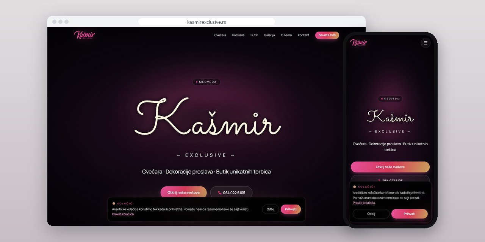
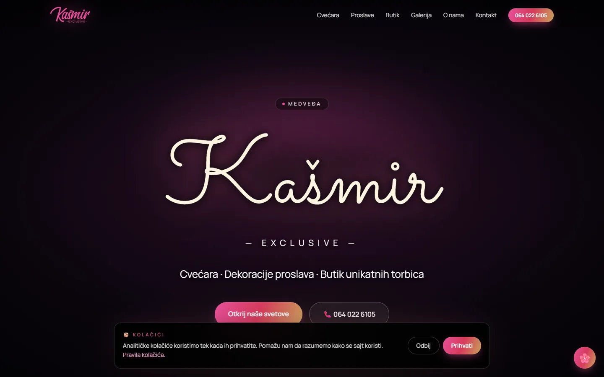
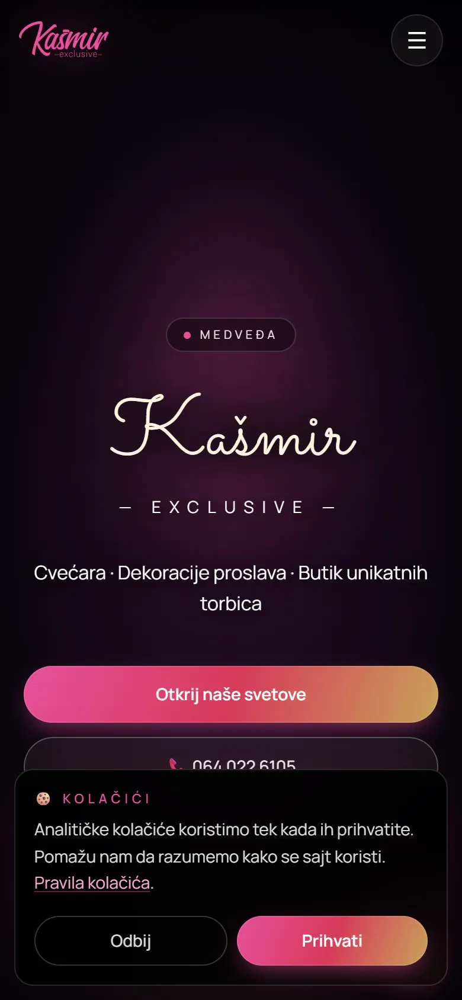
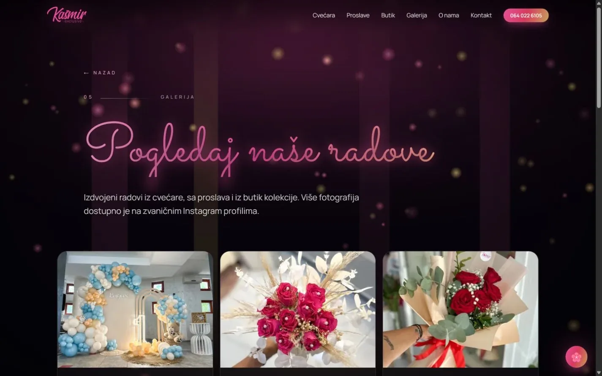
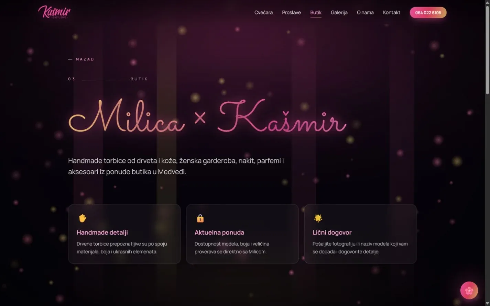

# Kašmir Exclusive

Site for a florist in Medveđa that also decorates celebrations and runs a boutique, with a separate way in for each of the three.

**[kasmirexclusive.rs](https://kasmirexclusive.rs/)** · [Case study (in Serbian)](https://svilenkovic.com/radovi/kasmir-exclusive) · [Srpski](README.sr.md)

> [!NOTE]
> Client project. The source code belongs to the client and stays in a private repository. This page describes what I built and how.

<table>
  <tr><td><b>Client</b></td><td>Kašmir Exclusive</td></tr>
  <tr><td><b>Industry</b></td><td>Florist, event decoration and boutique</td></tr>
  <tr><td><b>Location</b></td><td>Medveđa, Serbia</td></tr>
  <tr><td><b>Type</b></td><td>Multi-page website</td></tr>
  <tr><td><b>My role</b></td><td>Design, development, SEO, hosting and maintenance</td></tr>
  <tr><td><b>Stack</b></td><td>Next.js 16, React Three Fiber, Tailwind 4, TypeScript</td></tr>
</table>

## About the project

Kašmir Exclusive in Medveđa is a florist, an event decorator with cold fireworks and champagne fountains, and a boutique of handmade wooden and leather bags, all under one name. People arrive for very different reasons: one wants a bridal bouquet, another is planning a birthday, someone else is looking at bags. The site had to separate those visits and still look like one business.

The florist, celebrations and boutique each got their own page and address. The gallery, about page and contact are shared, and the homepage gives a quick overview of everything. With decorations the photos do most of the persuading, so the gallery carries the weight and the text explains what an order covers and how to arrange it. Soft transitions, controlled scrolling and the decorative 3D scene are only an extra: navigation and content work without the scene, and the motion calms down on small screens and for visitors who asked for reduced motion.

## What I built

- Six sections with their own addresses: florist, celebrations, boutique, gallery, about and contact
- A homepage that lists all sixteen services, from bridal bouquets to laser engraving and CNC wood decor
- A decorative React Three Fiber scene that loads on the first interaction and stays static without a GPU
- Phone, Viber and Instagram as the contact options, each one tap away on mobile
- Florist structured data with an offer catalogue, plus privacy, terms and cookie pages

## Results

| | Performance | Accessibility | Best practices | SEO |
| :-- | :-: | :-: | :-: | :-: |
| Mobile | 99 | 100 | 100 | 100 |
| Desktop | 97 | 100 | 100 | 100 |

PageSpeed Insights, lab test of the live site, September 2026. Security headers: 6 of 6. HTML validator: no errors. axe accessibility check: no violations. Structured data: `Brand`, `Florist`, `LocalBusiness`, `Organization`, `Person`.

## Screenshots

<table>
  <tr>
    <td width="68%" valign="top"></td>
    <td width="32%" valign="top"></td>
  </tr>
</table>

The gallery shows real decorations and flower arrangements

The boutique presents handmade details, the current offer and one-on-one consultation

---

Built by [D. Svilenković](https://svilenkovic.com).
